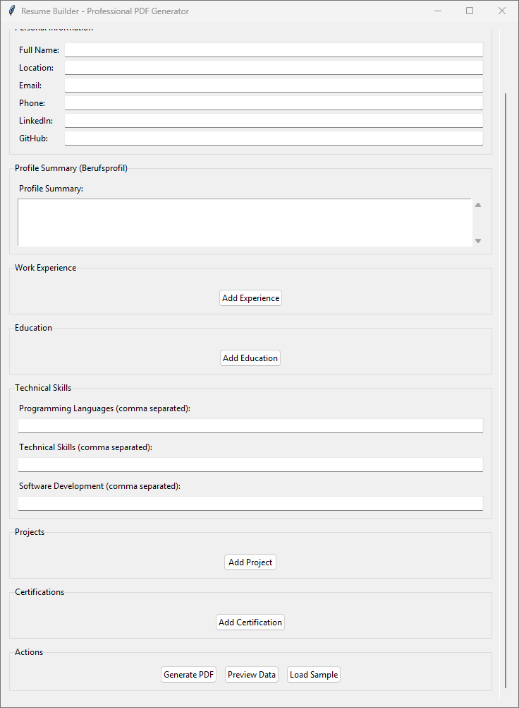

# 📄 Resume_Builder


A Python-based GUI application that generates professional PDF resumes with a clean, modern layout. Built with tkinter for the interface and ReportLab for PDF generation, this tool makes it easy to create and maintain your resume without dealing with complex formatting.

## ✨ Features

### 🎯 **Professional PDF Output**
- Clean, modern resume layout matching professional LaTeX formats
- Optimized spacing for single-page resumes
- German section headers (Berufsprofil, Berufliche Erfahrung, etc.)
- Professional typography with proper alignment and formatting

### 🖥️ **User-Friendly GUI**
- Intuitive interface with organized sections
- Scrollable layout accommodating all resume sections
- Dynamic entry management for experience, education, projects, and certifications
- Real-time form validation and data collection

### 💾 **Data Management**
- Save resume data to JSON format for easy editing
- Load previously saved resume data
- Sample data loading for quick start
- Clear all functionality for fresh starts
- Auto-load existing data on application startup

### 🔧 **Flexible Content Sections**
- **Personal Information**: Name, location, contact details, social profiles
- **Profile Summary**: Professional summary/objective section
- **Work Experience**: Multiple positions with responsibilities and technologies
- **Education**: Academic background with focus areas
- **Technical Skills**: Programming languages, technical skills, software development
- **Projects**: Detailed project descriptions with dates and locations
- **Certifications**: Professional certifications and their issuers

## 🚀 Installation

### Prerequisites
- Python 3.7 or higher
- pip package manager

### Install Dependencies
```bash
pip install reportlab
```

### Clone Repository
```bash
git clone https://github.com/weedu34/resume-builder.git
cd resume-builder
```

## 📖 Usage

### Running the Application
```bash
python resume_gui.py
```

### Quick Start Guide

1. **Launch the Application**
   - Run the Python script to open the GUI
   - The interface will automatically load any existing resume data

2. **Fill Out Your Information**
   - **Personal Info**: Enter your contact details and social profiles
   - **Profile Summary**: Write a compelling professional summary
   - **Experience**: Add work positions using the "Add Experience" button
   - **Education**: Include your academic background
   - **Skills**: List technical skills separated by commas
   - **Projects**: Showcase your important projects
   - **Certifications**: Add professional certifications

3. **Manage Dynamic Entries**
   - Use "Add" buttons to create new entries for experience, education, projects, and certifications
   - Use "Remove" buttons to delete unwanted entries
   - Entries are automatically numbered and organized

4. **Generate Your Resume**
   - Click "Generate PDF" to create your resume
   - Choose where to save the PDF file
   - Your professional resume is ready!

### File Operations

- **Save Data**: Export your form data to a JSON file for backup or sharing
- **Load Data**: Import previously saved resume data
- **Load Sample**: Populate the form with sample data to see the format
- **Clear All**: Reset the entire form to start fresh

## 📁 Project Structure

```
resume-builder/
│
├── resume_gui.py           # Main GUI application
├── resume_builder.py       # Core resume building logic (if separate)
├── README.md              # Project documentation
├── requirements.txt       # Python dependencies
├── sample_data/           # Sample resume data files
│   └── sample_resume.json
└── examples/              # Example output PDFs
    └── sample_output.pdf
```

## 🎨 Resume Layout

The generated PDF includes the following sections in order:

1. **Header**: Name and contact information
2. **Berufsprofil**: Professional summary/profile
3. **Berufliche Erfahrung**: Work experience with responsibilities and technologies
4. **Ausbildung**: Education background with focus areas
5. **Technische Fähigkeiten**: Technical skills categorized by type
6. **Projekt Arbeiten**: Project descriptions with details
7. **Zertifikate**: Professional certifications

## 💡 Tips for Best Results

### Content Guidelines
- **Profile Summary**: 3-4 sentences highlighting your key strengths and career focus
- **Experience**: Use action verbs and quantify achievements where possible
- **Skills**: Separate different skill categories with commas
- **Projects**: Include measurable outcomes and technologies used

### Formatting Tips
- Keep descriptions concise and impactful
- Use bullet points for easy readability
- Ensure all dates are consistently formatted
- Proofread all content before generating the final PDF

## 🔧 Customization

### Modifying Styles
The resume styling can be customized by editing the `_setup_custom_styles()` method in the `ResumeBuilder` class:

```python
def _setup_custom_styles(self):
    # Customize fonts, sizes, spacing, and colors
    self.styles.add(ParagraphStyle(
        name='CustomStyle',
        fontSize=10,
        spaceAfter=4,
        # Add your custom styling here
    ))
```

### Adding New Sections
To add new resume sections:

1. Create GUI elements in the `ResumeBuilderGUI` class
2. Add data collection logic in `collect_data()` method
3. Implement PDF generation logic in the `ResumeBuilder` class

## 🤝 Contributing

Contributions are welcome! Please feel free to submit a Pull Request. For major changes, please open an issue first to discuss what you would like to change.

### Development Setup
1. Fork the repository
2. Create a feature branch (`git checkout -b feature/AmazingFeature`)
3. Commit your changes (`git commit -m 'Add some AmazingFeature'`)
4. Push to the branch (`git push origin feature/AmazingFeature`)
5. Open a Pull Request

## 📝 License

This project is licensed under the MIT License - see the [LICENSE](LICENSE) file for details.

## 🆘 Troubleshooting

### Common Issues

**Issue**: PDF generation fails
**Solution**: Ensure ReportLab is properly installed: `pip install --upgrade reportlab`

**Issue**: GUI doesn't display properly
**Solution**: Make sure you're using Python 3.7+ with tkinter support

**Issue**: Data not saving
**Solution**: Check write permissions in the application directory

**Issue**: Sample data not loading
**Solution**: Ensure the JSON file is properly formatted and accessible

### Getting Help

If you encounter issues:

1. Check the [Issues](https://github.com/weedu34/resume-builder/issues) page for known problems
2. Search for existing solutions or workarounds
3. Create a new issue with detailed description and error messages
4. Include your Python version and operating system information

## 🙏 Acknowledgments

- Built with [ReportLab](https://www.reportlab.com/) for PDF generation
- Uses Python's built-in tkinter for the GUI interface
- Inspired by professional LaTeX resume templates
- Thanks to the open-source community for continuous inspiration

## 📊 Screenshots

### Main Interface



---

**Made with ❤️ for easier resume management**

*Star ⭐ this repository if it helped you create a better resume!*